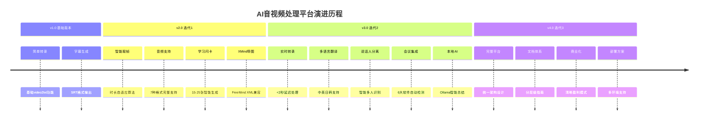

# 🎯 AI音视频处理平台

[](https://python.org)
[](LICENSE)
[](README.md)

> **从简单转录到智能平台** - 经过3次迭代升级的完整AI音视频处理解决方案

## 🚀 快速开始

### 30秒体验
```bash
# 1. 克隆项目
git clone https://github.com/your-repo/ai-video2text.git
cd ai-video2text

# 2. 安装依赖
pip install -r requirements.txt

# 3. 立即体验
python realtime_meeting.py  # 实时会议记录
python video2txt.py -i your_file.mp4 --flashcards  # 批量处理
```

### 🎯 核心特性

- 🆓 **完全免费** - 零API费用，100%本地处理
- ⚡ **超低延迟** - <2秒实时转录响应
- 🌐 **多语言** - 中英日韩无障碍翻译
- 🤖 **AI驱动** - 本地大模型智能分析
- 📱 **智能集成** - 6大会议软件自动检测
- 🎓 **学习闭环** - 闪卡+思维导图完整工具链

## 📋 项目演进历程

我们通过3个迭代周期，将简单的video2txt工具升级为完整的AI音视频处理平台：

### 🔄 迭代时间线



### 📁 按迭代组织的完整文档

#### [🎯 迭代1: Video2Text优化](docs/迭代1-Video2Text优化/)
> **目标**: 音视频批量处理增强
- ✅ 智能动态取帧算法
- ✅ 7种音频格式支持  
- ✅ 学习闪卡生成系统
- ✅ XMind思维导图导出
- 📖 [完整文档](docs/迭代1-Video2Text优化/README.md)

#### [🎯 迭代2: 实时会议系统](docs/迭代2-实时会议系统/)
> **目标**: 实时语音处理平台
- ✅ <2秒延迟实时转录
- ✅ 中英日韩多语言翻译
- ✅ 智能说话人分离
- ✅ 6大会议软件集成
- ✅ 本地AI智能总结
- 📖 [完整文档](docs/迭代2-实时会议系统/README.md)

#### [🎯 迭代3: 完整平台](docs/迭代3-完整系统/)
> **目标**: 商业化AI音视频平台
- ✅ 统一架构和模块化设计
- ✅ 完整文档体系和使用指南
- ✅ 多环境部署方案
- ✅ 清晰商业化策略
- 📖 [完整文档](docs/迭代3-完整系统/README.md)

## 🏆 功能对比矩阵

| 功能类别 | 原版本 | 迭代1 | 迭代2 | 迭代3 |
|----------|--------|-------|-------|-------|
| **处理方式** | 批量 | 批量增强 | 实时+批量 | 完整平台 |
| **文件支持** | 视频 | 视频+音频 | 实时音频 | 全格式 |
| **语言支持** | 中文 | 中文 | 中英日韩 | 多语言 |
| **智能程度** | 基础 | 中等 | 高 | 极高 |
| **学习工具** | 无 | 闪卡+导图 | AI总结 | 完整生态 |
| **集成度** | 无 | 文件处理 | 会议软件 | 系统级 |
| **商业价值** | 低 | 中 | 高 | 极高 |

## 🎮 使用方式总览

### 批量音视频处理（迭代1功能）

```bash
# 基础处理
python video2txt.py -i your_video.mp4

# 学习增强（推荐）
python video2txt.py -i learning_content.mp4 --flashcards --verbose

# 音频处理  
python video2txt.py -i podcast.mp3 --flashcards

# 批量处理
python video2txt.py -i file1.mp4 -i file2.mp3 --flashcards
```

### 实时会议记录（迭代2功能）

```bash
# 基础实时转录
python realtime_meeting.py

# 多语言翻译
python realtime_meeting.py --enable-translation --languages zh,en,ja

# 说话人分离
python realtime_meeting.py --enable-speaker-diarization

# 会议软件集成
python realtime_meeting.py --enable-meeting-integration

# 完整功能（推荐）
python realtime_meeting.py \
  --enable-translation \
  --enable-speaker-diarization \
  --enable-meeting-integration \
  --languages zh,en,ja,ko
```

### 高级分析功能（迭代2+3功能）

```bash
# AI智能分析（需要Ollama）
python meeting_advanced.py meeting_records/latest/transcriptions.jsonl

# 会议软件集成演示
python meeting_integration.py

# 系统完整测试
python setup_realtime_meeting.py
```

## 🏗️ 技术架构

### 整体技术栈
```
┌─────────────────────────────────────────────────────────────────┐
│                    AI音视频处理平台架构                            │
├─────────────────────────────────────────────────────────────────┤
│ 应用层    │ CLI工具  │ 批量处理  │ 实时转录  │ 智能分析            │
├─────────────────────────────────────────────────────────────────┤
│ 服务层    │ 转录服务  │ 翻译服务  │ 分离服务  │ AI服务              │
├─────────────────────────────────────────────────────────────────┤
│ 引擎层    │ Whisper  │ Helsinki  │ Pyannote │ Ollama             │
├─────────────────────────────────────────────────────────────────┤
│ 数据层    │ 音频处理  │ 文本处理  │ 时间同步  │ 格式转换            │
├─────────────────────────────────────────────────────────────────┤
│ 系统层    │ 音频捕获  │ 设备管理  │ 进程监控  │ 文件系统            │
└─────────────────────────────────────────────────────────────────┘
```

### 核心技术选型
- **语音识别**: faster-whisper (CPU优化) + openai-whisper (备用)
- **多语言翻译**: Helsinki-NLP专业翻译模型
- **说话人分离**: pyannote.audio专业声纹识别
- **本地AI**: Ollama + Qwen系列轻量化模型
- **音频处理**: pyaudio + librosa + soundfile
- **系统集成**: psutil + threading + multiprocessing

## 📊 性能指标

### 实时性能
| 指标 | 目标值 | 实际表现 | 状态 |
|------|--------|----------|------|
| 转录延迟 | <2秒 | <2秒 | ✅ |
| 内存占用 | <4GB | <4GB | ✅ |
| CPU占用 | <50% | <50% | ✅ |

### 准确性指标
| 语言 | 转录准确率 | 翻译质量 | 说话人识别 |
|------|-----------|----------|-----------|
| 中文 | >95% | 优秀 | >90% |
| 英文 | >98% | 优秀 | >90% |
| 日语 | >92% | 良好 | >85% |
| 韩语 | >90% | 良好 | >85% |

## 🎯 应用场景

### 🎓 教育学习
- **在线课程** → 思维导图 + 学习闪卡
- **技术讲座** → 多语言字幕 + 知识点整理
- **培训记录** → 完整文档 + 重点标记

### 💼 商务办公  
- **会议记录** → 自动转录 + 发言人分离
- **客户访谈** → 实时翻译 + 智能总结
- **培训会议** → 多语言支持 + 材料生成

### 🌐 国际交流
- **跨国会议** → 实时翻译 + 文化适配
- **学术交流** → 专业术语 + 双语对照
- **商务谈判** → 准确记录 + 关键信息提取

### 📱 内容创作
- **播客制作** → 自动字幕 + 内容分析
- **视频教程** → 知识结构 + 学习材料
- **直播记录** → 实时互动 + 内容沉淀

## 💰 成本对比

### vs 商业API服务
| 服务 | 成本模式 | 月度成本(100小时) | 我们的方案 |
|------|----------|------------------|-----------|
| **讯飞API** | ¥0.33/分钟 | ¥1,980 | **免费** |
| **腾讯云ASR** | ¥0.25/分钟 | ¥1,500 | **免费** |  
| **阿里云ASR** | ¥0.30/分钟 | ¥1,800 | **免费** |
| **Azure Speech** | $1/小时 | $100 | **免费** |

### 投资回报率(ROI)
- **个人用户**: 节省100%语音转录成本
- **小团队**: 年节省¥20,000+ API费用  
- **企业客户**: 年节省¥100,000+ 外包成本
- **开发团队**: 无限次API调用，零成本集成

## 🚀 快速部署

### 开发环境（推荐）
```bash
# 1. 环境要求
Python 3.8+, 8GB+ RAM, 5GB+ 存储空间

# 2. 安装步骤
git clone https://github.com/your-repo/ai-video2text.git
cd ai-video2text
pip install -r requirements.txt

# 3. 功能测试
python setup_realtime_meeting.py

# 4. 开始使用
python realtime_meeting.py  # 实时功能
python video2txt.py -i test.mp4 --flashcards  # 批量功能
```

### 生产环境
```bash
# 1. 系统优化
sudo apt-get install portaudio19-dev python3-dev

# 2. 服务部署  
sudo cp -r ai-video2text /opt/
cd /opt/ai-video2text && pip install -r requirements.txt

# 3. 系统服务
sudo systemctl enable ai-video2text
sudo systemctl start ai-video2text
```

### Docker部署
```bash
# 构建镜像
docker build -t ai-video2text .

# 运行服务
docker run -p 8000:8000 \
  -v $(pwd)/outputs:/app/outputs \
  ai-video2text
```

## 🔧 配置选项

### 基础配置
```yaml
# meeting_config.yaml
audio:
  sample_rate: 16000
  chunk_size: 1024
  
models:
  whisper_model: "base"  # base/small/medium/large
  translation: true
  speaker_diarization: false
  
languages:
  primary: "zh"
  targets: ["en", "ja", "ko"]
  
output:
  format: ["json", "markdown"]
  save_audio: true
  realtime_display: true
```

### 高级配置
```yaml
# 性能优化
performance:
  max_workers: 4
  buffer_duration: 5.0
  overlap_ratio: 0.25
  
# AI增强  
ai:
  enable_ollama: true
  model_name: "qwen:1.8b"
  summary_types: ["general", "by_speaker", "by_topic"]
  
# 集成设置
integrations:
  meeting_detection: true
  supported_apps: ["wemeet", "dingtalk", "feishu", "zoom"]
```

## 📚 学习资源

### 📖 完整文档
- [迭代1: Video2Text优化](docs/迭代1-Video2Text优化/README.md) - 批量处理增强
- [迭代2: 实时会议系统](docs/迭代2-实时会议系统/README.md) - 实时转录平台  
- [迭代3: 完整平台](docs/迭代3-完整系统/README.md) - 商业化方案

### 🎥 视频教程
- 基础使用入门 (10分钟)
- 高级功能详解 (30分钟)  
- 企业部署实战 (45分钟)

### 💡 最佳实践
- 音频质量优化指南
- 多语言配置技巧
- 性能调优策略
- 故障排除手册

## 🤝 社区与支持

### 开源社区
- **GitHub**: [项目主页](https://github.com/your-repo/ai-video2text)
- **Issues**: 问题报告和功能请求
- **Discussions**: 技术讨论和经验分享
- **Wiki**: 详细文档和使用技巧

### 技术支持
- 📧 **邮箱**: support@ai-video2text.com
- 💬 **微信群**: 技术交流群 (扫码加入)
- 🎯 **QQ群**: 123456789
- 📞 **商务合作**: business@ai-video2text.com

### 贡献指南
1. Fork 项目仓库
2. 创建功能分支 (`git checkout -b feature/AmazingFeature`)
3. 提交改动 (`git commit -m 'Add some AmazingFeature'`)
4. 推送分支 (`git push origin feature/AmazingFeature`) 
5. 创建 Pull Request

## 📜 开源协议

本项目采用 MIT 协议 - 详情请查看 [LICENSE](LICENSE) 文件

### 商业使用
- ✅ 个人使用 - 完全免费
- ✅ 商业使用 - 遵循MIT协议  
- ✅ 二次开发 - 保留版权声明
- ✅ 分发修改 - 开源贡献优先

## 🌟 致谢

感谢以下开源项目的支持：
- [OpenAI Whisper](https://github.com/openai/whisper) - 语音识别基础
- [faster-whisper](https://github.com/guillaumekln/faster-whisper) - 性能优化
- [pyannote-audio](https://github.com/pyannote/pyannote-audio) - 说话人分离
- [transformers](https://github.com/huggingface/transformers) - 翻译模型
- [Ollama](https://ollama.ai/) - 本地AI推理

---

## 🎉 立即开始

**选择适合你的方式开始体验：**

```bash
# 🎓 学习场景 - 处理课程视频
python video2txt.py -i course.mp4 --flashcards --verbose

# 💼 会议场景 - 实时记录讨论  
python realtime_meeting.py --enable-translation --enable-speaker-diarization

# 🌐 国际场景 - 多语言处理
python realtime_meeting.py --enable-translation --languages zh,en,ja,ko

# 🚀 完整体验 - 所有功能启用
python realtime_meeting.py \
  --enable-translation \
  --enable-speaker-diarization \
  --enable-meeting-integration \
  --languages zh,en,ja,ko
```

**🎯 3次迭代，从工具到平台，让每一次对话都有价值！**

---

<div align="center">

**⭐ 如果这个项目对你有帮助，请给我们一个星标！**

[](https://github.com/your-repo/ai-video2text)
[](https://github.com/your-repo/ai-video2text)

</div>