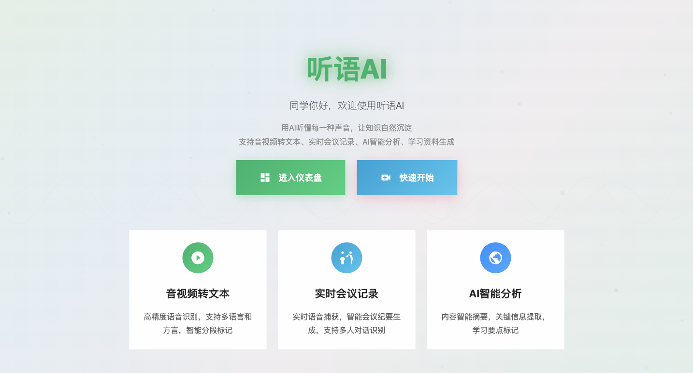
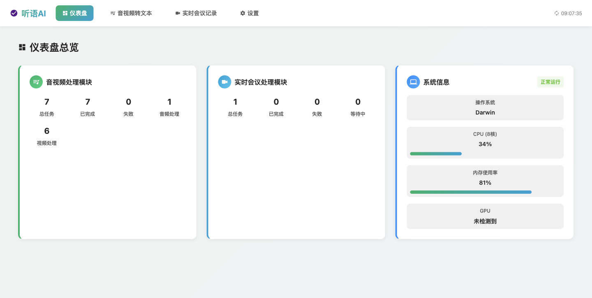
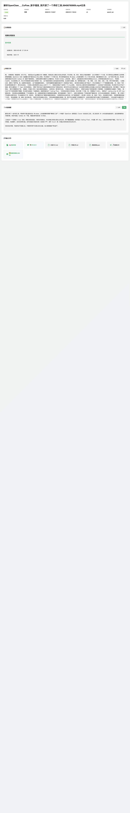
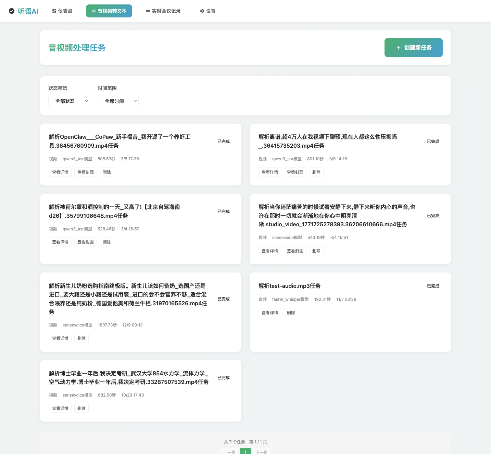
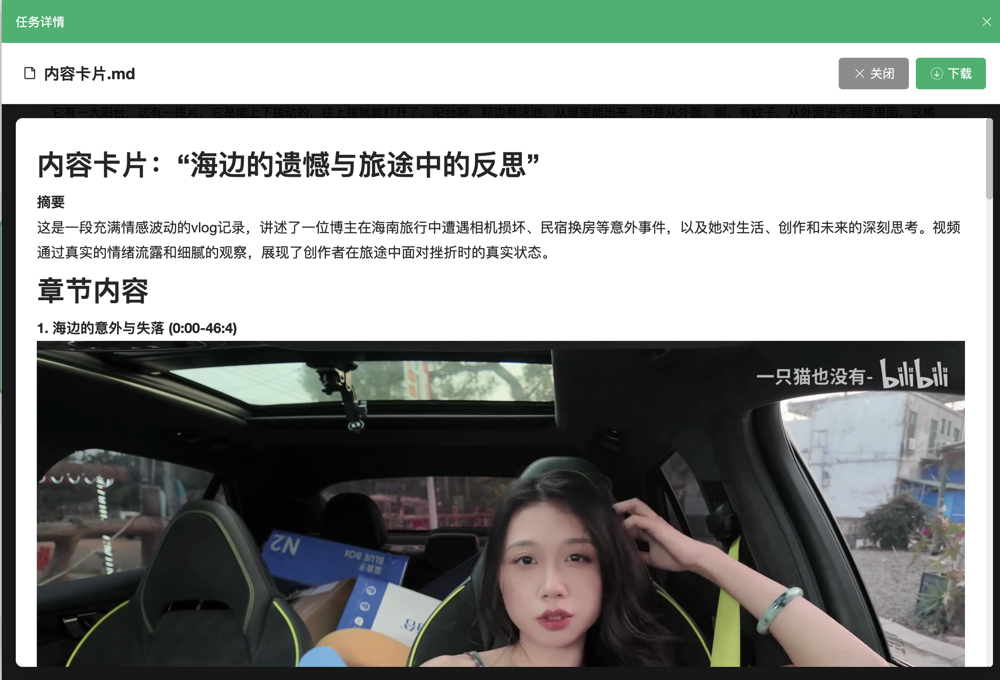
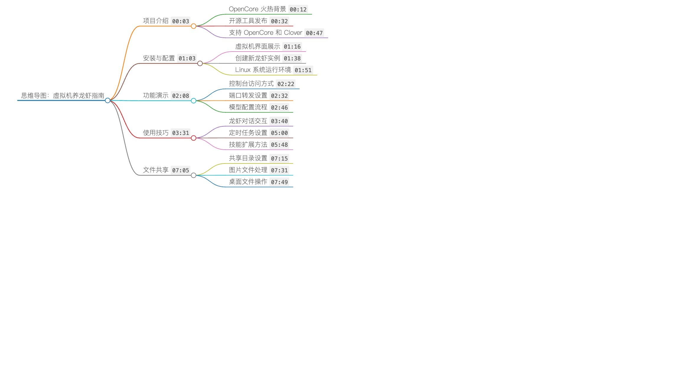
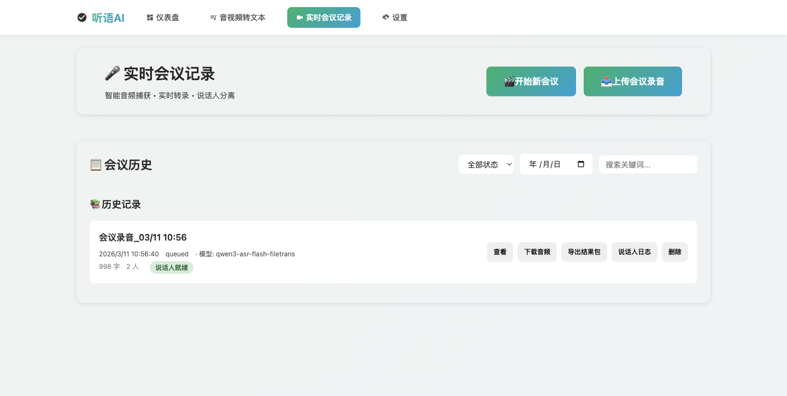
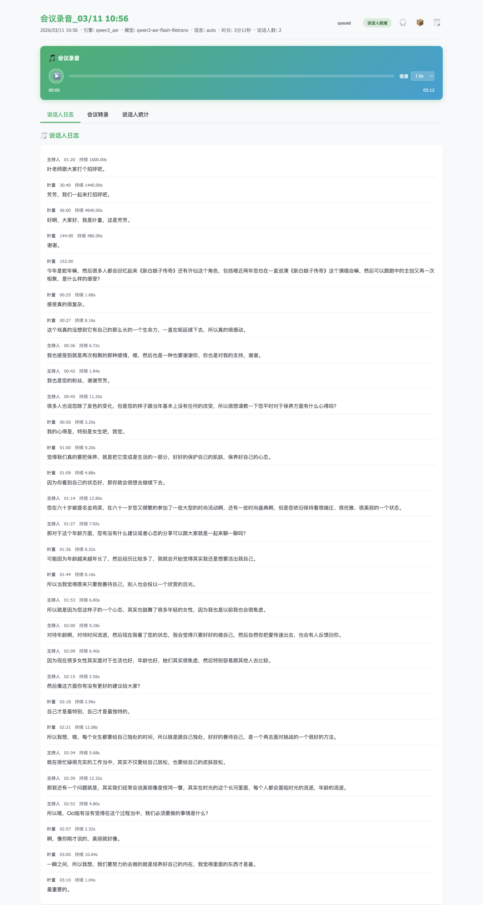

# Tingyu AI Video/Audio Transcription Platform

A local-first transcription and content extraction platform for video/audio, meeting recordings, and structured outputs. Designed for private deployment and production use with flexible ASR engine selection.

## Use Cases
- Meeting minutes and archiving
- Interviews, podcasts, lectures
- Video transcription for editing
- Multilingual content processing

## Core Capabilities
- Multi-engine ASR (local + cloud)
- Web UI + REST API + CLI
- Task queue and progress tracking
- Structured outputs: summary, mind map, content cards, flashcards, keyframes
- Speaker diarization (manual trigger)


## Highlights
- Role-based prompt templates bound to content types
- Custom prompts (DIY) for content generation tuning
- One-click mind map snapshot, XMind import supported
- Accurate video/audio transcription with selectable engines
- Manual speaker log generation

## Quick Start
```bash
# macOS
pip install -r requirements-mac.txt

# Windows
pip install -r requirements-win.txt

# (Optional) Live meeting capture dependency
pip install sounddevice

# Start service
python app/main.py
# Open: http://127.0.0.1:19080
```

## ASR Models & API Notes
- **Local ASR**: Whisper / FasterWhisper / SenseVoice / Dolphin (Settings → Speech Models → Local)
- **Cloud ASR**: DashScope Qwen3-ASR (Flash / FileTrans / Realtime)
  - FileTrans requires OSS config + public URL, and `oss2`
  - Realtime uses PCM/OPUS streaming input
- **Remote API**: Settings → Speech Models → Cloud/Remote (Base URL + Endpoint + auth)
- **WhisperX**: Settings → Speech Models → WhisperX (diarization, Hugging Face token required)

> Qwen3-ASR does not provide speaker logs. Generate manually in meeting detail using
> `models/speaker-diarization-community-1`.

## API Documentation
- `docs/API.md`

## Getting Started (0 → 1)
- Guide: `docs/用户从0到1使用指南.md`
- Start from the Settings page to configure ASR, cloud API, and OSS.

## Outputs
Output directory: `data/outputs/<task_id>/`

Common outputs:
- Transcript (txt / json)
- Summary
- Mind map
- Content cards
- Flashcards (md / csv)
- Keyframes

## Project Structure
```
app/            FastAPI entrypoint
biz/            routes and services
core/           ASR/AI/audio engines
public/         Web UI
commands/       CLI workflows
models/         local models
data/           task inputs/outputs
```

## Screenshots (placeholder)
- 
- 
- 
- 
- 
- 
- 
- 

## License
MIT
